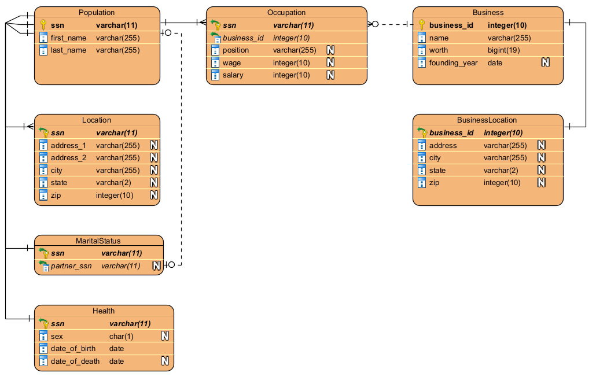

# PIMS Database Structure
The database will be split into normalized form to ensure data consistency. It will be built firstly from the tables "Population" and "Business" which will define the set of all individuals present in the fictional country of Compsciana.

The Population table will contain a primary key that is a unique social securtiy number and every individual's most basic information: first name and last name. Of course, there are bound to be people with similar names or exactly the same names, so this is adjusted using the social security number which is unique to every individual person.

The social security key is used to join with other tables, which will also use the social security number as a foreign key from the Population table. There are various tables used to define a person's livelihood and status:
 - **Population**: a table that defines in its primary key a person's social security number, along with their first and last names.
 - **Location**: a table that contains the most current registered location of a user, i.e. their home address split into various columns (Address, City, State, Zip).
 - **Health**: a table that contains the date of birth and date of death of an individual, as well as their and birth-assigned sex. *TODO: Self-identifying gender may be included at a later date.*
 - **MaritalStatus**: a table that contains the marriage status of an individual, and the social security key of the other individual they may be married to.
 - **Occupation**: a table that contains the occupational status of an individual, including their location of work, position, salary/wage, and date of joining. This table keeps track of only the most recent occupation. If a person left their place of work or was fired, their business_id (the id of the business they work at) is left as NULL in the table.

To work with the Occupation table, a business table and a business location table is needed to help relate the population with their places of work, and what position they have in each location.

This also means that while the SSN and BusinessIDs must be unique, their presence in the other tables may appear multiple times (such as if an individual is working two jobs, they will appear twice in the Occupation table).

 - **Business**: a table that defines in its primary key a business' ID. This ID is used by other tables to help with joining and relating business information to the Occupation table.
 - **BusinessLocation**: a table that contains the most current registered location of a business' headquarters.

# Schema

# Data Generation
Names, streets, and city names were all pulled from various sources and compiled together. Credit through the original webpages where this information was found is shown below.
 - [First Names](https://www.nrscotland.gov.uk/statistics-and-data/statistics/statistics-by-theme/vital-events/names/babies-first-names/babies-first-names-summary-records-comma-separated-value-csv-format)
 - [Last Names](https://github.com/fivethirtyeight/data/blob/master/most-common-name/surnames.csv)
 - [Street Names](https://catalog.data.gov/dataset/street-names)
 - [City Names](https://simplemaps.com/data/world-cities)*

\* Some data was removed to prevent errors in encoding and output.

