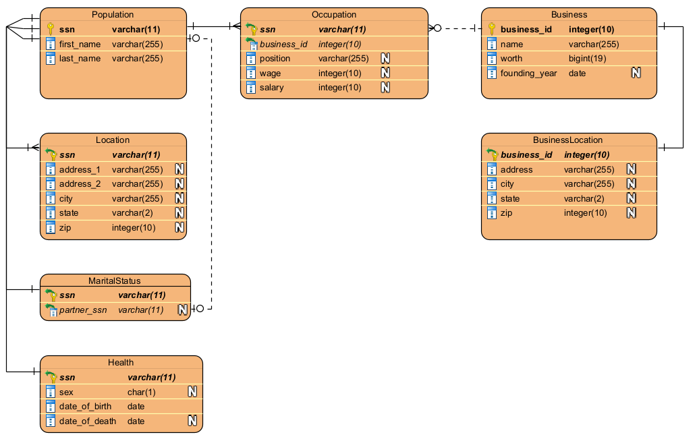

# PIMS Database Structure
The database will be split into normalized form to ensure data consistency. It will be built firstly from the tables "Population" and "Business" which will define the set of all individuals present in the fictional country of Compsciana.

The Population table will contain a primary key that is a unique social securtiy number and every individual's most basic information: first name and last name. Of course, there are bound to be people with similar names or exactly the same names, so this is adjusted using the social security number which is unique to every individual person.

The social security key is used to join with other tables, which will also use the social security number as a foreign key from the Population table. There are various tables used to define a person's livelihood and status:
 - **Population**: a table that defines in its primary key a person's social security number, along with their first and last names.
 - **Location**: a table that contains the most current registered location of a user, i.e. their home address split into various columns (Address, City, State, Zip).
 - **Health**: a table that contains the date of birth and date of death of an individual, as well as their and birth-assigned sex. *TODO: Self-identifying gender may be included at a later date.*
 - **MaritalStatus**: a table that contains the marriage status of an individual, and the social security key of the other individual they may be married to.
 - **Occupation**: a table that contains the occupational status of an individual, including their location of work, position, salary/wage, and date of joining. This table keeps track of only the most recent occupation. If a person left their place of work or was fired, their business_id (the id of the business they work at) is left as NULL in the table.

To work with the Occupation table, a business table and a business location table is needed to help relate the population with their places of work, and what position they have in each location.

This also means that while the SSN and BusinessIDs must be unique, their presence in the other tables may appear multiple times (such as if an individual is working two jobs, they will appear twice in the Occupation table).

 - **Business**: a table that defines in its primary key a business' ID. This ID is used by other tables to help with joining and relating business information to the Occupation table.
 - **BusinessLocation**: a table that contains the most current registered location of a business' headquarters.

# Schema

# Data Generation
Names, streets, and city names were all pulled from various sources and compiled together. Credit through the original webpages where this information was found is shown below.
 - [First Names](https://www.nrscotland.gov.uk/statistics-and-data/statistics/statistics-by-theme/vital-events/names/babies-first-names/babies-first-names-summary-records-comma-separated-value-csv-format)
 - [Last Names](https://github.com/fivethirtyeight/data/blob/master/most-common-name/surnames.csv)
 - [Street Names](https://catalog.data.gov/dataset/street-names)
 - [City Names](https://simplemaps.com/data/world-cities)*

The data generation is handled through a connection of Python scripts and C++ program(s) that work together to pull random data. The data was obtained through various online resources through CSV files, saved in the `csv` directory. Normalized data is saved in the `data` directory, and is obtained from using bash and Python scripts and C++ programs to take large sets of data from CSVs and isolate them into a usable format for the generation programs.

The generation programs will take the normalized data and generate either more normalized data, such as the `gen_dates.py`, while others will be used to produce debug data and object data, such as `gen_people.py`. The programs that generate the debug/object data will save their information in two respective locations:
 1. A user readable information file in the `debug` directory
 2. An object (pickle) file that is used by `gen_queries.py` to easily obtain previously generated information without having to parse through the debug file.  

Data then has its query generated through `gen_queries.py`, which saves all relevant information into the `upload` directory. These are the queries ran in the SQL Server to upload the information. Files in the `upload` directory are generated only on client-side machines. No data from this directory is stored on the repo.

The original sets of the data are included in compressed files to allow for easy transference, a tarball for Linux and 7-zip for Windows.

# Generation Programs
The generation programs function to print data in a .dat format and a .csv format for uploading. This means that for generating the uploading queries, the generation program needs a variety of information to generate multiple different scripts for the various tables.

The insertions are generated into CSV files, as the amount of data required is too large for standard SQL queries. However, an optional flag is available if a SQL query must be generated for inserting values.

These CSV files are expected to be inserted into the database using `BULK INSERT`. Note that `KEEPNULLS` must be set in the insertion to avoid missing foreign key errors (as otherwise, SQL Server will interpret NULL foreign keys as empty strings, and throw an error).

A simple dynamic SQL script is included in `init.sql` to help assist in the insertion. Simply copy and paste the entirety of `init.sql` into your query editor, replace **PATH TO UPLOAD CSV DIRECTORY HERE** with the path on your computer to PIMS/database/upload/csv/ (make sure there is a slash at the end!) and then the script will create the tables and insert the data for you!

**Note**: Make sure that the path you provided in the init.sql is the path to your upload/csv directory, not the database/csv directory that contains some of the unnormalized data.

\* Some data was removed to prevent errors in encoding and output.
